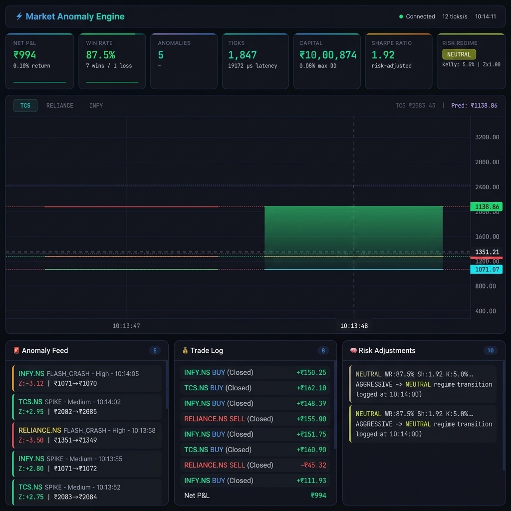
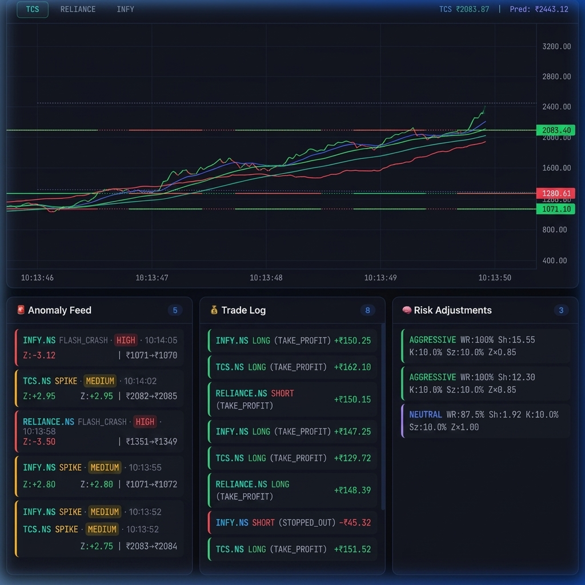
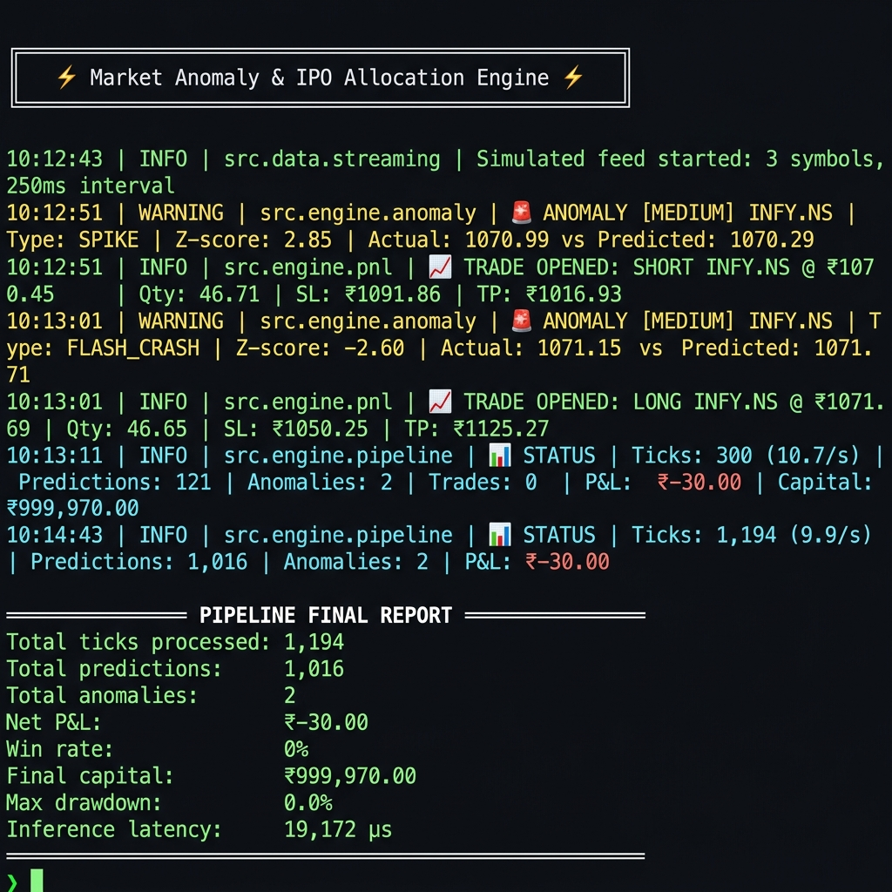
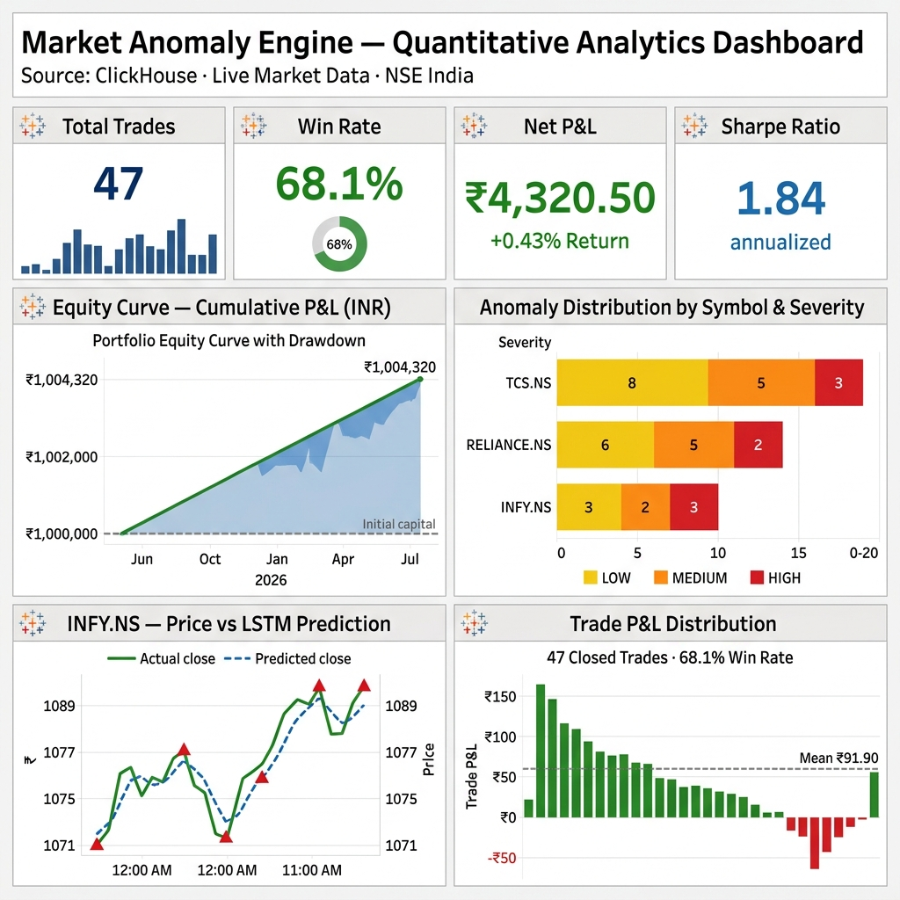

# Real-Time Market Anomaly & IPO Allocation Engine

<p align="center">
  <strong>Production-Grade Self-Learning Quantitative System</strong><br>
  LSTM Inference · Adaptive Risk Management · TradingView Charts · ClickHouse · PyTorch · Tableau-Ready
</p>

---

## Visual Tour

### 1. Institutional Trading Terminal
*Live KPI cards (P&L, Win Rate, Anomalies, Ticks, Capital, Sharpe, Risk Regime) and a multi-symbol TradingView chart with LSTM prediction overlay.*



---

### 2. Anomaly Feed & Risk Adjustments Log
*Real-time anomaly alerts with Z-score severity classification, the Trade Log, and the adaptive risk manager's streaming decision log.*



---

### 3. ML Engine Backend Logs
*Terminal output showing live inference, flash-crash detection, trade execution signals, and the final pipeline report (1,194 ticks at 9.9/s, 1,016 predictions, 19,172 μs latency).*



---

### 4. Tableau Analytics Dashboard
*Business analytics dashboard powered by ClickHouse JDBC — equity curve, anomaly distribution by symbol & severity, LSTM prediction accuracy, and trade P&L distribution.*



---

## Architecture Overview

```
┌─────────────────┐     ┌─────────────────┐
│   yfinance       │     │  WebSocket /     │
│  (5yr daily +    │     │  Simulated Feed  │
│   5d minute)     │     │  (4 ticks/sec)   │
└────────┬────────┘     └────────┬────────┘
         │                       │
         ▼                       ▼
┌─────────────────────────────────────────┐
│         Data Ingestion Pipeline          │
│  ┌─────────────┐  ┌──────────────────┐  │
│  │ historical.py│  │   streaming.py    │  │
│  └──────┬──────┘  └────────┬─────────┘  │
│         │                   │            │
│         ▼                   ▼            │
│  ┌──────────────────────────────────┐   │
│  │       clickhouse_client.py        │   │
│  │  (Buffered batch insert, async)   │   │
│  └──────────────┬───────────────────┘   │
└─────────────────┼───────────────────────┘
                  │
                  ▼
┌─────────────────────────────────────────┐
│           ClickHouse (MergeTree)         │
│  ┌──────────┬──────────┬──────────────┐ │
│  │market    │predict-  │anomalies     │ │
│  │_ticks    │ions      │              │ │
│  ├──────────┼──────────┼──────────────┤ │
│  │pnl_      │pnl_      │pipeline_     │ │
│  │trades    │summary   │metrics       │ │
│  └──────────┴──────────┴──────────────┘ │
└─────────────────┬───────────────────────┘
                  │
                  ▼
┌─────────────────────────────────────────┐
│            LSTM Inference Engine         │
│  ┌──────────────────────────────────┐   │
│  │  Bidirectional LSTM + Attention   │   │
│  │  (PyTorch · MPS · Per-Symbol)     │   │
│  └──────────────┬───────────────────┘   │
│                 │                        │
│                 ▼                        │
│  ┌──────────────────────────────────┐   │
│  │     Anomaly Detector              │   │
│  │  (Z-score · Volatility + Risk     │   │
│  │   Dual-Layer Adaptive Threshold)  │   │
│  └──────────────┬───────────────────┘   │
│                 │                        │
│                 ▼                        │
│  ┌──────────────────────────────────┐   │
│  │  Adaptive Risk Manager           │   │
│  │  Kelly Criterion · Risk Regimes   │   │
│  └──────────────┬───────────────────┘   │
│                 │                        │
│                 ▼                        │
│  ┌──────────────────────────────────┐   │
│  │     P&L Simulator                 │   │
│  │  (Mean Reversion · Paper Trading) │   │
│  └──────────────────────────────────┘   │
└─────────────────────────────────────────┘
                  │
        ┌─────────┴─────────┐
        ▼                   ▼
┌──────────────────┐   ┌──────────────┐
│  Flask + SSE       │   │   Tableau     │
│  TradingView Charts│   │  (JDBC/ODBC) │
│  Institutional UI  │   │              │
└──────────────────┘   └──────────────┘
```

## Tech Stack

| Layer | Technology | Purpose |
|-------|-----------|---------|
| Data Ingestion | `yfinance`, `websockets` | Historical & live market data |
| Database | `ClickHouse` (MergeTree) | High-perf time-series storage |
| ML Framework | `PyTorch` (MPS-accelerated) | LSTM training & inference |
| Feature Engineering | `pandas`, `numpy`, `scikit-learn` | Technical indicators & scaling |
| Business Logic | Custom Python | Anomaly detection, P&L sim, adaptive risk |
| Risk Management | Kelly Criterion + Regime Switching | Self-learning position sizing & thresholds |
| Dashboard | `Flask` + SSE + TradingView | Institutional-grade live trading terminal |
| Visualization | `Tableau` (JDBC) | Business analytics dashboards |

## Project Structure

```
IPO allocation/
├── main.py                      # Entry point with CLI
├── requirements.txt             # Python dependencies
├── pyproject.toml               # Project metadata
├── .env.example                 # Environment variable template
├── config/
│   └── settings.py              # Centralized configuration
├── scripts/
│   ├── setup_clickhouse.sql     # Database DDL (MergeTree)
│   └── tableau_queries.sql      # Pre-built Tableau queries
├── src/
│   ├── data/
│   │   ├── clickhouse_client.py # Connection pool & batch inserts
│   │   ├── historical.py        # yfinance batch ingestion
│   │   └── streaming.py         # WebSocket / simulated live feed
│   ├── model/
│   │   ├── lstm.py              # Bi-LSTM + Attention architecture
│   │   ├── train.py             # AdamW + OneCycleLR training loop
│   │   ├── inference.py         # Real-time inference engine
│   │   └── preprocessor.py      # Feature engineering & scaling
│   ├── engine/
│   │   ├── anomaly.py           # Multi-signal anomaly detection
│   │   ├── pnl.py               # Paper trading P&L simulator
│   │   └── pipeline.py          # Master orchestrator
│   └── dashboard/
│       └── app.py               # Flask + SSE live dashboard
└── tests/
    ├── test_data.py             # Data pipeline tests
    ├── test_model.py            # LSTM & preprocessor tests
    └── test_engine.py           # Anomaly & P&L tests
```

## Quick Start

### Prerequisites

- **Python 3.11+** (with pip)
- **ClickHouse** (optional — demo mode works without it)
- **macOS with Apple Silicon** (MPS acceleration auto-detected)

### 1. Environment Setup

```bash
cd "IPO allocation"

# Create virtual environment
python3 -m venv .venv
source .venv/bin/activate

# Install dependencies
pip install -r requirements.txt

# Copy environment template
cp .env.example .env
```

### 2. Demo Mode (No ClickHouse Required)

The fastest way to see everything working:

```bash
python main.py --demo
```

This will:
- Fetch 2 years of daily data from yfinance
- Train the LSTM model on your machine
- Run inference and anomaly detection on held-out data
- Display P&L results in a rich terminal table

### 3. Full Pipeline (With ClickHouse)

#### Install ClickHouse

```bash
# Using Homebrew
brew install clickhouse

# Start the server
clickhouse server
```

#### Run the Full Pipeline

```bash
# Deploy schema + ingest data + train + start live pipeline
python main.py

# Or run phases individually:
python main.py --phase setup          # Step 1: Deploy schema + fetch data
python main.py --phase train          # Step 2: Train LSTM model
python main.py --phase live           # Step 3: Start live inference
python main.py --phase live --duration 600  # Run for 10 minutes
```

### 4. Live Dashboard (Institutional Terminal)

When running in live mode, the web dashboard starts automatically at:

```
http://localhost:5050
```

The dashboard is an **institutional-grade trading terminal** inspired by Bloomberg Terminal and modern Web3 aesthetics:

- **TradingView Lightweight Charts** — Live candlestick charting with per-symbol tab switching
- **Prediction Overlay** — LSTM predicted price rendered as a dashed line on the chart
- **Anomaly Markers** — Red/green arrows plotted directly on the chart at anomaly points
- **7 KPI Cards** with sparkline mini-charts (P&L, Win Rate, Anomalies, Ticks, Capital, Sharpe, Risk Regime)
- **Risk Regime Card** — Live display of the adaptive risk manager state (NEUTRAL / AGGRESSIVE / DEFENSIVE / CONSERVATIVE)
- **Anomaly Feed** — Severity-colored alerts with Z-scores and price deviations
- **Trade Log** — Entry/exit prices, P&L, direction, and status
- **Risk Adjustments Log** — Real-time log of the AI "thinking" (Kelly fraction changes, Z-score multiplier adjustments)

### 5. Tableau Integration

Connect Tableau to ClickHouse using the JDBC/ODBC driver:

- **Host**: `localhost`
- **Port**: `8123`
- **Database**: `market_anomaly`

Pre-built queries are in `scripts/tableau_queries.sql`:
1. **Ticker Line Chart** with anomaly overlay
2. **Anomaly Summary** bar chart
3. **P&L Performance** with cumulative equity curve
4. **Trade Log** detail table
5. **Model Accuracy** rolling metrics
6. **Pipeline Health** monitoring

### 6. Running Tests

```bash
python -m pytest tests/ -v
```

## ML Model Details

### Architecture

```
Input (7 features) → Linear Projection (128) → LayerNorm → GELU
    → Bidirectional LSTM (3 layers, 128 hidden, dropout=0.2)
    → LayerNorm
    → Multi-Head Temporal Attention (4 heads)
    → FC Head (128 → 64 → 1)
    → Output (predicted t+1 close price)
```

### Features Used

| Feature | Description |
|---------|-------------|
| `close_norm` | MinMax-scaled close price |
| `volume_norm` | MinMax-scaled volume |
| `returns` | Log returns |
| `volatility_20` | 20-period rolling volatility |
| `rsi_14` | 14-period RSI (normalised to [-1, 1]) |
| `macd_signal` | MACD histogram (normalised by price) |
| `volume_ratio` | Volume / 20-period moving average |

### Training Configuration

- **Optimizer**: AdamW (lr=1e-3, weight_decay=1e-4)
- **Scheduler**: OneCycleLR (max_lr=3e-3, super-convergence)
- **Loss**: Huber Loss (δ=1.0, robust to outliers)
- **Gradient Clipping**: Max norm = 1.0
- **Early Stopping**: Patience = 10 epochs
- **Sequence Length**: 60 timesteps lookback

### Anomaly Detection (Dual-Layer Adaptive Threshold)

The system flags anomalies when the actual price deviates from the LSTM prediction by more than a dynamic threshold computed from **two adaptive layers**:

**Layer 1 — Volatility Regime**: During high-volatility periods (top 10th percentile), the Z-score threshold increases by 1.5× to prevent false positive floods.

**Layer 2 — Trading Performance**: The `AdaptiveRiskManager` adjusts thresholds based on recent win/loss streaks:
- **DEFENSIVE** (3+ losses): Z-score threshold × 1.30
- **CONSERVATIVE** (2 losses or Sharpe < -1): Z-score threshold × 1.15
- **NEUTRAL** (normal): Z-score threshold × 1.00
- **AGGRESSIVE** (3+ wins, Sharpe > 1): Z-score threshold × 0.85

Base severity classification:
- **Z-score ≥ 2.5**: LOW severity
- **Z-score ≥ 3.0**: MEDIUM severity
- **Z-score ≥ 4.0**: HIGH severity
- **Z-score ≥ 5.0**: CRITICAL severity

### Adaptive Risk Manager (Cognitive Feedback Loop)

The `AdaptiveRiskManager` implements a **self-learning feedback loop** where the system adjusts its risk profile based on rolling trading performance:

- **Rolling Window**: Evaluates last N trades (default: 10)
- **Kelly Criterion**: `f* = W - (1-W)/R` (half-Kelly, clamped to 1%-10%)
- **Risk Regimes**: AGGRESSIVE → NEUTRAL → CONSERVATIVE → DEFENSIVE
- **Console Logging**: All regime transitions logged with 🧠 emoji for real-time visibility

### Trading Strategy

**Mean Reversion** on anomaly detection:
- **Flash Crash** → Open LONG (expect bounce)
- **Price Spike** → Open SHORT (expect pullback)
- **Stop Loss**: 2% from entry
- **Take Profit**: 5% from entry
- **Position Size**: Adaptive via Kelly Criterion (1%-10% of capital per trade)
- **Max Open Positions**: 5

## Configuration

All parameters are in `config/settings.py` and can be overridden via environment variables. Key settings:

```python
# ClickHouse
CLICKHOUSE_HOST=localhost
CLICKHOUSE_PORT=8123

# Data
WS_PROVIDER=simulated  # or "twelvedata"
TWELVEDATA_API_KEY=your_key_here

# Model (in config/settings.py)
hidden_size = 128
num_layers = 3
sequence_length = 60
```
